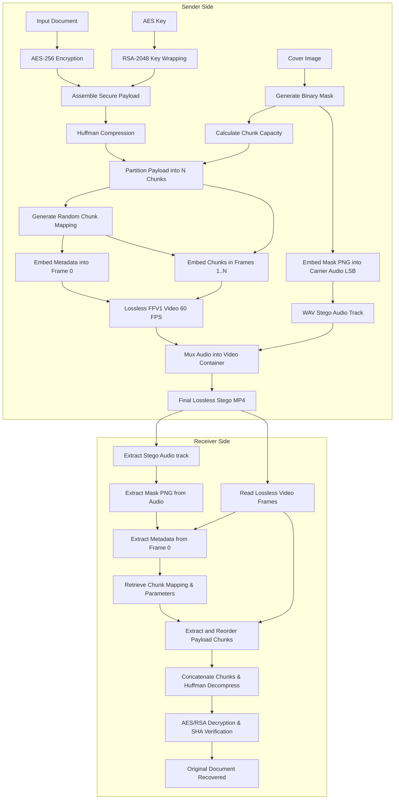

# MedHideX+

MedHideX+ is a privacy-preserving medical data sharing system that combines cryptography, image steganography, audio steganography, video generation, integrity verification, authentication, and user-specific activity tracking.

The sender encrypts a medical document, builds a secure payload, compresses it with Huffman coding, and divides the payload into $N$ chunks (where $N$ corresponds to the number of video frames matching the audio duration at 30 FPS, minus one). These chunks are randomly embedded across the video frames (Frames $1 \dots N$) using LSB steganography. Frame 0 is reserved for metadata containing the chunk distribution mapping and configuration. The binary mask is saved as a PNG and hidden inside the audio carrier track (MP3 or WAV). The final video is generated as a lossless 60 FPS MP4 file with the audio track. The receiver uploads the MP4, extracts the audio and frames directly, recovers the binary mask from the audio track, reads the metadata from Frame 0, reassembles the payload chunks in the correct mapping order, and decrypts the document.

## Features

- Modern public landing page explaining the project, workflow, features, and technology stack
- JWT-based login and registration
- Protected app pages and protected backend APIs
- User-specific activity history
- AES-256 document encryption
- RSA-2048 encryption for AES key protection
- SHA-256 integrity verification
- Huffman compression before visual embedding
- High-Performance NumPy Vectorization for 24x faster frame embedding and extraction
- Multi-frame video steganography with chunked payload distribution
- Randomized frame-level chunk mapping and distribution
- Frame 0 metadata reservation for chunk layout mapping
- PNG binary mask generation from cover image
- WAV audio steganography for hiding the PNG binary mask in the audio track
- MP3 or WAV carrier upload, plus browser-recorded WAV carrier audio
- Exact audio repeating/looping to match video duration
- Lossless 60 FPS video generation using FFV1 to preserve steganographic pixels
- Original filename/extension recovery for files such as PDFs
- Extraction status note showing that the recovered payload came from encrypted data
- PSNR and SSIM image quality metrics
- Downloadable stego video and recovered document
- MongoDB storage for users, encrypted file metadata, and workflow reports

## Project Structure

```text
Project/
|-- Backend/
|   |-- app.py
|   |-- core.py
|   |-- Requirements.txt
|   |-- Auth/
|   |   |-- auth_handler.py
|   |   `-- password_handler.py
|   |-- crypto/
|   |   |-- aes_util.py
|   |   |-- payload_builder.py
|   |   |-- rsa_util.py
|   |   `-- sha_util.py
|   |-- database/
|   |   |-- mongo.py
|   |   `-- schemas.py
|   |-- routes/
|   |   |-- auth_routes.py
|   |   |-- crypto_routes.py
|   |   |-- download_routes.py
|   |   |-- health_routes.py
|   |   |-- metrics_routes.py
|   |   |-- report_routes.py
|   |   `-- stego_routes.py
|   `-- steganography/
|       |-- adaptive_embed.py
|       |-- adaptive_extract.py
|       |-- audio_mask.py
|       |-- bit_utils.py
|       |-- capacity.py
|       |-- image_analysis.py
|       |-- mask_generator.py
|       |-- metrics.py
|       `-- video_util.py
|-- Frontend/
|   `-- MedHideX/
|       |-- package.json
|       |-- vite.config.js
|       `-- src/
|           |-- api/
|           |-- components/
|           `-- pages/
|               |-- LandingPage.jsx
|               |-- LoginPage.jsx
|               |-- RegisterPage.jsx
|               |-- DashBoard.jsx
|               |-- EncryptPage.jsx
|               |-- ExtractPage.jsx
|               |-- MetricsPage.jsx
|               |-- HistoryPage.jsx
|               `-- Medshell.jsx
|-- .gitignore
`-- README.md
```

## Backend

`Backend/app.py` creates the FastAPI app, configures CORS, and registers all route modules.

Main routes:

```text
GET  /                         Health check
POST /register                 Create user account
POST /login                    Login and receive JWT token
POST /encrypt                  Encrypt document, store metadata, return payload
POST /embed                    Embed payload into image, hide mask in audio, return stego video
POST /extract                  Extract and decrypt data from one stego video
POST /decrypt                  Decrypt payload and return recovered file URL
POST /metrics                  Calculate PSNR and SSIM for images
GET  /reports                  User-specific activity history
GET  /download/{type}/{file}   Download generated files
```

Download types include:

```text
video       Generated MP4 stego video with embedded recovery data
extracted   Recovered document
```

Protected backend routes require:

```text
Authorization: Bearer <JWT_TOKEN>
```

Protected routes:

- `/encrypt`
- `/embed`
- `/extract`
- `/decrypt`
- `/metrics`
- `/reports`

## MongoDB Collections

Database name:

```text
medhidex
```

Collections:

- `users`: username, `password` (bcrypt password hash), and legacy `password_hash` (HMAC-SHA256) fallback
- `files`: encrypted file metadata (SHA-256 hash, owner, patient/doctor IDs, original filename) and local path (`encrypted_file_path`) pointing to disk storage (bypassing MongoDB's 16MB BSON limit for files of any size)
- `reports`: user-specific workflow history for encryption, embedding, extraction, decryption, and metrics (also indexable for legacy reports lacking a `username` field)

The history API filters records by the authenticated user, so each user only sees their own activity.

## Frontend

The React frontend lives in `Frontend/MedHideX`.

Public pages:

- `/` - Landing page
- `/login` - Login
- `/register` - Registration

Protected pages:

- `/dashboard` - Main app dashboard
- `/encrypt` - Encrypt and embed workflow
- `/extract` - Extract and decrypt workflow
- `/metrics` - PSNR and SSIM metrics
- `/history` - User-specific usage/activity history

After login, the frontend stores the JWT in `localStorage` as:

```text
medhidex_token
```

The API helper automatically sends the token with protected requests.

## Requirements

- Python 3.10 or newer
- Node.js and npm
- MongoDB running locally on port `27017`

MongoDB URL:

```text
mongodb://localhost:27017/
```

## Run Backend

From the project root:

```powershell
cd Backend
python -m venv venv
.\venv\Scripts\activate
pip install -r Requirements.txt
uvicorn app:app --reload
```

Backend URL:

```text
https://localhost:8000
```

API docs:

```text
https://localhost:8000/docs
```

## Run Frontend

From another terminal:

```powershell
cd Frontend\MedHideX
npm install
npm run dev
```

Frontend URL:

```text
https://localhost:5173
```

## Steganography Flow




### Sender Workflow

1. **Input File Encryption**: The input file (document, image, or any supported file format) is read as raw bytes and encrypted with AES-256. The AES key is wrapped with RSA-2048, and a SHA-256 integrity hash of the original document is created.
2. **Secure Payload Construction**: The secure payload is assembled (containing the encrypted file, wrapped key, integrity hash, original filename/extension, and status note) and compressed using Huffman coding.
3. **Binary Mask Generation**: A binary mask is generated from the cover image.
4. **Capacity Calculation**: The single-frame embedding capacity is calculated as:
   $$\text{Chunk Capacity} = \text{Number of embeddable pixels in mask} \times 3 \text{ channels} \times \text{lsb\_bits}$$
   where $\text{lsb\_bits}$ is the number of LSB bits used for embedding (1-bit or 3-bit LSB).
5. **Chunk Partitioning**:
   - The encrypted data is divided into $N$ chunks of nearly equal size.
   - The number of chunks is initially calculated by dividing the total compressed bit size by the calculated chunk capacity plus one.
   - If audio is provided, the minimum number of video frames is calculated using the audio duration and a frame rate of 30 FPS ($\text{audio\_duration} \times 30$).
   - The total number of video frames is:
     $$\text{Total Video Frames} = \max(\text{Chunks Needed} + 1, \text{Audio Frames}, 2)$$
   - The encrypted data is then divided into exactly $N = \text{Total Video Frames} - 1$ chunks so that every frame in the video contains a steganographic image.
6. **Random Sequence Generation**: A random sequence is generated to map each chunk index to a unique stego frame index in the range $[1 \dots N]$.
7. **Metadata Embedding (Frame 0)**: The random sequence mapping, configuration, and bit parameters are encoded as JSON metadata, converted to bits, and embedded into Frame 0 of the video using 3-bit LSB.
8. **Steganographic Chunk Embedding**: The stego frames are created by embedding each payload chunk into its mapped frame (Frames $1 \dots N$) in the randomized order using the configured $\text{lsb\_bits}$.
9. **Audio Mask Embedding**: The binary mask PNG bytes are embedded into the carrier audio file (MP3 or WAV) using audio LSB steganography.
10. **Video Generation & Audio Repeating**:
    - The video is written using the lossless `FFV1` codec at 60 FPS (each unique 30 FPS frame is duplicated twice to guarantee 100% losslessness in the MP4 container).
    - If the generated video duration exceeds the original audio duration, the carrier audio track is automatically repeated/looped until the video ends.
    - The audio track is muxed into the video container to produce the final `.mp4` file.

### Receiver Workflow

1. **Stego Video Upload**: The receiver uploads the generated MP4 stego video.
2. **Audio Track Extraction**: The audio track is extracted from the video container as WAV.
3. **Mask Recovery**: The binary mask PNG is extracted from the WAV audio track.
4. **Video Frame Extraction**: All video frames are read directly from the MP4. Unique frames are retrieved by sampling every 2nd frame (filtering out the 60 FPS duplicates).
5. **Metadata Decoded from Frame 0**: Metadata is extracted from Frame 0 using the binary mask and LSB settings to retrieve the chunk mapping, bit count, and LSB configuration.
6. **Chunk Extraction & Reassembly**: Each chunk is extracted from its mapped frame in the correct randomized order. The chunks are concatenated and Huffman-decompressed to restore the secure payload.
7. **Decryption & Verification**: AES/RSA decryption restores the original file bytes, and SHA-256 verification confirms the file's integrity. The recovered file is saved using its original extension.

## Typical Workflow

1. Start MongoDB.
2. Start the FastAPI backend.
3. Start the React frontend.
4. Open the landing page, register a user, and log in.
5. Go to the dashboard.
6. Upload a document, cover image, and MP3/WAV carrier audio, or record carrier audio in the browser.
7. Encrypt and embed the payload, then download the generated MP4 stego video.
8. Extract and decrypt by uploading only the stego video.
9. Download the recovered document with its original extension.
10. View personal usage records in Activity History and calculate PSNR/SSIM using Metrics.

## Build Frontend

```powershell
cd Frontend\MedHideX
npm run build
```

Build output:

```text
Frontend/MedHideX/dist
```

## Security Notes

- Do not commit generated RSA keys.
- Do not commit uploaded medical documents.
- Do not commit generated stego images, stego audio, stego videos, masks, or recovered documents.
- Keep `.env` files out of Git.
- Use a stronger secret key through environment variables before production deployment.

## Key Storage

- **Public and private keys**: When a user registers, the app generates an RSA-2048 key pair. The public key is stored in the `users` collection as `public_key`. For convenience in the current local setup, the private key is also stored in the `users` collection as `private_key` (plaintext) and an `encrypted_private_key` is kept as well. If you plan to deploy to production, remove plaintext private key storage and require a secure unlock workflow.

## Performance Optimization & NumPy Vectorization

- **The Challenge**: The standard nested loops over rows, columns, and color channels for pixel manipulation were highly CPU-bound. For a 512x512 cover image, processing each frame took ~1.7 seconds, causing the multi-frame embedding/extraction process for videos to take minutes. In addition, pure Python loops in audio steganography conversions between bytes and bits caused significant overhead.
- **The Solution**: 
  - **Mask Coordinate Pre-computation**: We compute the mask coordinates `np.where(mask == 1)` exactly once per API request (instead of inside every frame's loop), avoiding thousands of duplicate scans.
  - **Coordinate Slicing / Lazy Evaluation**: We slice the coordinates to `[:num_pixels_to_modify]` so that we only retrieve, flatten, and assign back the exact subset of pixels that are actually modified. This makes processing speed independent of image size for small payload chunks.
  - **Vectorized Audio Steganography**: Replaced pure Python loops in `audio_mask.py` (bytes-to-bits, bits-to-bytes, extraction, and embedding) with 100% vectorized NumPy matrix operations (using `np.unpackbits`, `np.packbits`, bitwise shifts, and reshaping).
- **The Result**: 
  - Audio steganography operations achieved a **~58x speedup**.
  - Frame embedding and extraction loops now execute in a fraction of a second, yielding a **14x end-to-end pipeline speedup** (e.g., test suites executing under 5 seconds instead of over a minute).

## Format Notes

- Carrier audio can be uploaded as MP3 or WAV, or recorded in the browser as WAV.
- Recovery uses the exact video track and audio track of the MP4 directly.
- The video is written using the lossless `FFV1` codec and saved in an `.mp4` container, preventing compression loss so that stego frames remain perfectly recoverable.
- Each unique 30 FPS frame is duplicated twice to write a standard 60 FPS stream, which is extracted by sampling every 2nd frame.
- If `ffmpeg` is installed, MP3 carrier audio is decoded normally. Without `ffmpeg`, the backend accepts MP3 by writing raw MP3 bytes inside a generated WAV structure.
- Huffman compression helps reduce payload size, and NumPy vectorization ensures embedding/extraction takes less than 0.1s per frame.
- The recovered document bytes are not modified with extra text, keeping PDFs valid.

## Generated Files

The app creates runtime files in:

- `uploads/`
- `stego/`
- `extracted/`
- `keys/`
- `Backend/uploads/`
- `Backend/stego/`
- `Backend/extracted/`
- `Backend/keys/`

These are ignored by `.gitignore`.
