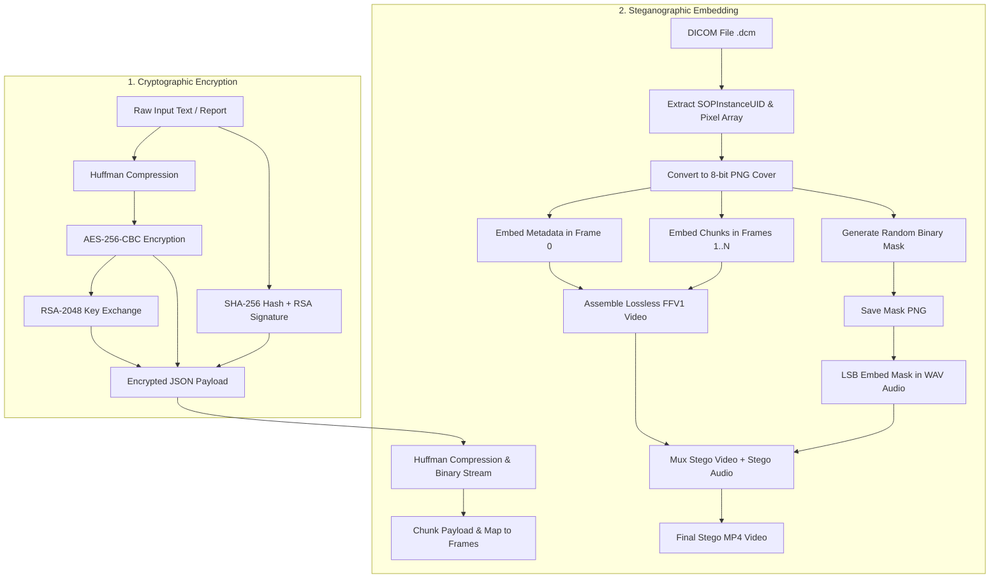
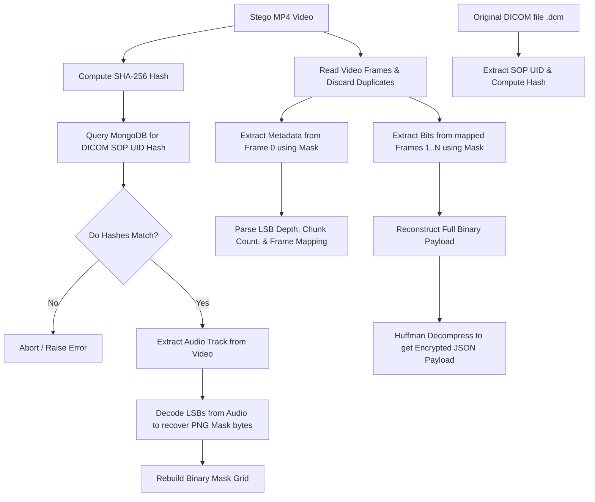

# MedHideX+ Backend Pipeline: Technical Reference Manual
This document provides a detailed, step-by-step breakdown of the **MedHideX+** backend security pipeline, tracking data flow from the raw text inputs through hybrid encryption, compression, steganographic frame embedding, audio mask embedding, and lossless video assembly.

---

## System Overview
The backend leverages a **dual-channel hybrid cryptographic-steganographic approach**:
1. **Cryptographic Layer**: Secures the patient data using high-grade hybrid encryption (**AES-256-CBC** for payload, **RSA-2048 with PKCS1_OAEP** for key exchange, and **SHA-256 with PKCS1-v1_5** for digital signatures).
2. **Steganographic Layer**: Embeds the encrypted payload across multiple frames of a lossless video stream using Least Significant Bit (LSB) embedding, controlled by a pseudo-random binary mask. The binary mask itself is dynamically hidden within the audio track using audio steganography, creating an extremely secure, cover-image-dependent data hiding system.



---

## Part 1: The Cryptographic Pipeline (Encryption)

This pipeline runs inside the `/encrypt` endpoint (defined in [crypto_routes.py](file:///c:/Users/Puneeth%20Kumar/OneDrive/Desktop/CNS/Project/Backend/routes/crypto_routes.py#L23-L98)). Its purpose is to ensure **Confidentiality, Integrity, and Authenticity (CIA)** for medical reports.

### Step 1.1: Custom Huffman Compression
To minimize data footprint (and ease the payload size before embedding), the text is compressed using a custom Huffman encoder:
- The system reads the raw file bytes as text and encodes it to UTF-8.
- It counts byte frequencies and builds a Huffman tree.
- It formats the compressed output into a binary bitstring with a custom header layout:
  1. **Magic Bits**: `0100100001011000` (16 bits) to identify valid compressed data.
  2. **Original Size**: 32 bits representing the length of the decompressed text.
  3. **Unique Character Count**: 16 bits representing the frequency table size.
  4. **Frequency Table**: A sequential listing of each unique byte (8 bits) and its occurrence count (32 bits).
  5. **Compressed Body**: The Huffman-encoded variable-length bit stream.
- This bit string is converted back to ASCII bytes for the encryption step.

### Step 1.2: Symmetric Payload Encryption (AES-256-CBC)
Since asymmetric cryptography (RSA) cannot directly encrypt large payloads efficiently, a hybrid encryption scheme is used:
- The system generates a cryptographically secure random 256-bit (32 bytes) key using PyCryptodome's `get_random_bytes(32)`.
- The Huffman-compressed data is padded to match the AES block size (16 bytes) using PKCS7 padding.
- The payload is encrypted using **AES-256 in Cipher Block Chaining (CBC) mode**.
- A random 16-byte **Initialization Vector (IV)** is generated during encryption.
- Both the ciphertext and IV are base64-encoded.

### Step 1.3: Asymmetric Key Exchange (RSA)
To securely transmit the AES key to the recipient:
- The backend imports the server's global 2048-bit RSA public key (`keys/public.pem`).
- The 256-bit symmetric AES key is encrypted using **RSA with PKCS1_OAEP padding** (Optimal Asymmetric Encryption Padding), which ensures cipher security against active attacks.
- The resulting encrypted key is base64-encoded.

### Step 1.4: Integrity & Authenticity Verification (SHA-256 & Digital Signatures)
To ensure the file has not been altered and originates from an authorized source:
- The system calculates the **SHA-256 hash** of the raw uploaded document.
- The server signs this hash using its private key (`keys/private.pem`) via the standard **PKCS#1 v1.5 signature scheme** (`pkcs1_15`).
- The signature is base64-encoded.

### Step 1.5: Payload Packaging and Storage
- The system packages all encryption outputs into a JSON dictionary:
  ```json
  {
    "aes": {
      "iv": "base64_encoded_iv",
      "ciphertext": "base64_encoded_ciphertext"
    },
    "rsa": "base64_encoded_rsa_encrypted_aes_key",
    "hash": "sha256_hash_hex",
    "signature": "base64_encoded_digital_signature",
    "original_filename": "patient_report.txt",
    "encryption_note": "This file contains encrypted data.",
    "doctor_id": "authenticated_username"
  }
  ```
- To bypass MongoDB's 16MB BSON document size limit, the JSON string is saved as a physical file on disk at `uploads/encrypted/enc_{uuid}.json`.
- A metadata document is logged in the MongoDB `files` collection linking the logged-in doctor, the patient ID, the path of the encrypted JSON file, the SHA-256 hash, and timestamps.

---

## Part 2: The Steganographic Pipeline (Embedding)

This pipeline runs inside the `/embed` endpoint (defined in [stego_routes.py](file:///c:/Users/Puneeth%20Kumar/OneDrive/Desktop/CNS/Project/Backend/routes/stego_routes.py#L51-L267)). It hides the encrypted JSON payload inside a video container using a cover image and audio track.

### Step 2.1: Cover Media Normalization
- **DICOM Image Processing**: The user uploads a medical image in DICOM (`.dcm`) format. The system extracts the `SOPInstanceUID` to hash it with SHA-256 for future database verification.
- **Grayscale/RGB Conversion**: The raw DICOM pixel array (which may be high-depth 16-bit) is normalized to standard 8-bit (0–255) pixels. If it is 2D grayscale, it is converted to a 3-channel RGB image and saved as a PNG (`uploads/converted_{uuid}.png`) to act as the cover image.
- **Audio Processing**: The cover audio (WAV or MP3) is read. If it is in MP3 format, it is transcoded to uncompressed `pcm_s16le` WAV format at 44.1kHz using FFmpeg (or a raw sample fallback).

### Step 2.2: Binary Mask Generation
- The system generates a pseudo-random binary mask of identical dimensions `(height, width)` to the cover image.
- Coordinates where the mask value is `1` define the active pixels used for steganography.
- The mask is saved to disk as a binary black-and-white PNG (`stego/mask_{uuid}.png`).

### Step 2.3: Capacity Estimation & Payload Preparation
- The payload string (the JSON payload from the encryption step) is compressed again using Huffman encoding and converted to a binary string.
- A 32-bit length prefix is prepended to the binary stream indicating the total size of the payload.
- The system calculates the embedding capacity per image frame based on the number of active mask coordinates (`coords`), color channels (3), and the LSB depth parameter (`lsb_bits`, default 3):
  $$\text{Capacity per frame} = \text{pixels where mask is 1} \times 3 \text{ channels} \times \text{lsb\_bits}$$
- If the payload is larger than the capacity of a single frame, it is split into $N$ roughly equal chunks. The number of frames in the final video will be $N + 1$ (where Frame 0 is reserved for metadata, and Frames 1 to $N$ hold the payload chunks).

### Step 2.4: Randomized Frame Index Mapping
- To prevent sequential extraction attacks, the chunks are not embedded in order.
- The system generates a list representing frame indices $1$ to $N$, and shuffles it randomly:
  $$\text{mapping} = \text{shuffle}([1, 2, \dots, N])$$
- The $i$-th chunk of the payload will be embedded in frame `mapping[i]`.

### Step 2.5: Frame 0 Metadata Injection
- An extraction client needs structural variables to decode the video. The system builds a metadata JSON:
  ```json
  {
    "lsb_bits": 3,
    "total_bits": 45832,
    "num_chunks": 14,
    "mapping": [4, 12, 1, 9, 2, 8, 14, 5, 3, 11, 7, 13, 6, 10]
  }
  ```
- This metadata is converted to binary, prepended with a 32-bit length prefix, and embedded into **Frame 0** of the video sequence. Because Frame 0 is critical and small, it is embedded using a fixed depth of 3 LSB bits at the mask coordinates.

### Step 2.6: Pixel-Level LSB Vectorized Embedding
For Frame 0 and all chunk frames, the actual embedding happens at the pixel level in [chunk_embed.py](file:///c:/Users/Puneeth%20Kumar/OneDrive/Desktop/CNS/Project/Backend/steganography/chunk_embed.py#L20-L63):
- It targets the indices where the mask is `1` across the channels.
- To embed $B$ bits into a channel value (an 8-bit integer):
  1. The existing $B$ least significant bits of the pixel channel are cleared using a bitwise AND:
     $$\text{cleared\_pixel} = \text{original\_pixel} \ \& \ \sim((1 \ll B) - 1)$$
  2. The next $B$ bits of the payload are converted to an integer value $V$.
  3. The cleared pixel is updated using a bitwise OR:
     $$\text{stego\_pixel} = \text{cleared\_pixel} \ | \ V$$
- This process is highly optimized using NumPy vectorization by reshaping the pixel values and binary arrays to match shapes, running the calculations in parallel rather than using slow Python loops.

### Step 2.7: Lossless Video Stream Assembly
- Simply writing frames into a compressed H.264 or H.265 MP4 container would corrupt the hidden data because lossy video compression algorithms alter pixel values.
- To prevent this, the backend writes the frame sequence (Frame 0 to Frame N) using the **lossless FFV1 codec** (`fourcc = "FFV1"`) into an AVI file.
- The frames are duplicated during writing (each written twice) to stretch the frame sequences smoothly from a standard 30 FPS representation to a 60 FPS video structure.

### Step 2.8: Audio Steganography for the Binary Mask
- The binary mask is required to extract the data, but it cannot be sent separately. Instead, the mask is embedded *into the audio carrier*.
- The PNG mask image is read as raw bytes, converted to a bitstream, and prepended with a 32-bit length prefix.
- The bits are embedded into the LSBs of the 16-bit WAV audio samples (embedding 2 bits per audio frame using the mask `252` to clear the lowest 2 bits and ORing the value).
- If the video duration is longer than the audio, the audio is looped/repeated to match.

### Step 2.9: Audio-Video Muxing & DB Registration
- The lossless video track and the stego-audio track are merged together into a standard MP4 file container using FFmpeg:
  `ffmpeg -y -i video.avi -i audio.wav -c:v copy -c:a pcm_s16le stego_video.mp4`
- The system calculates the SHA-256 hash of this final stego video (`video_sha256`).
- It inserts an association record in MongoDB mapping `video_hash` to `dicom_uid_hash`. This binds the stego video with the original patient's DICOM image.
- The final file paths are registered under the reports database, and the files are made available for client download.

---

## Part 3: The Steganographic Extraction Pipeline (Recovery)

This pipeline runs inside the `/extract` endpoint (defined in [stego_routes.py](file:///c:/Users/Puneeth%20Kumar/OneDrive/Desktop/CNS/Project/Backend/stego_routes.py#L269-L396)). It extracts the hidden payload using the stego video and the original DICOM file.



### Step 3.1: Cryptographic Binding Verification
- The backend computes the SHA-256 hash of the uploaded stego video.
- It queries the MongoDB `dicom_videos_collection` to retrieve the registered `dicom_uid_hash`.
- The user uploads the original DICOM image. The server parses it to extract its `SOPInstanceUID`, computes its SHA-256 hash, and compares it to the database record. If the hashes do not match, the extraction is rejected immediately, preventing brute force extraction using mismatched carriers.

### Step 3.2: Mask Recovery from Audio
- The audio track is split from the video using FFmpeg.
- The system reads the first 32 bits from the audio track's LSBs (2 bits per sample) to extract the length prefix.
- It continues reading the exact number of bits indicated by the prefix, packs the bits into bytes, and decodes them as a PNG image stream.
- This image is binarized to reconstruct the exact `1`s and `0`s grid of the original binary mask.

### Step 3.3: Frame Analysis and Metadata Extraction
- The video is opened frame-by-frame. The duplicates are discarded by selecting every second frame (`frames[::2]`).
- Using the recovered binary mask, the system extracts the first 32 bits from **Frame 0** (metadata frame) to get the metadata length.
- It then reads the metadata bitstream, translates it to ASCII, and parses it as a JSON object to obtain the `lsb_bits`, `total_bits`, `num_chunks`, and the randomized frame `mapping`.

### Step 3.4: Reassembly and Huffman Decompression
- For each chunk index $i$ from $0$ to $N-1$, the system selects frame `mapping[i]`.
- It reads the specified number of bits from the pixel values where the mask is `1`, using vectorized bit shifts:
  $$\text{value} = \text{stego\_pixel} \ \& \ ((1 \ll \text{lsb\_bits}) - 1)$$
- The bits are concatenated in the correct order to reconstruct the complete binary payload.
- The length prefix is removed, and the binary stream is decoded using Huffman decompression to restore the encrypted JSON payload.

---

## Part 4: The Decryption Pipeline (Recovery)

This pipeline runs inside the `/decrypt` endpoint (defined in [crypto_routes.py](file:///c:/Users/Puneeth%20Kumar/OneDrive/Desktop/CNS/Project/Backend/routes/crypto_routes.py#L103-L171)).

### Step 4.1: Asymmetric Private Key Decryption
- The server reads the RSA private key from the local files.
- It extracts the `rsa` field (the encrypted AES key) from the JSON payload and decrypts it using **RSA with PKCS1_OAEP padding** to recover the raw 256-bit AES symmetric key.

### Step 4.2: Symmetric Decryption
- Using the recovered AES key and the `iv` parsed from the JSON, the system decrypts the ciphertext (`aes.ciphertext`) using **AES-256-CBC**.
- It removes the PKCS7 padding to reveal the Huffman-compressed bitstring bytes.

### Step 4.3: Huffman Decompression
- The decompressed bytes are decoded to ASCII and fed into the Huffman decoder.
- The decoder parses the file header, reconstructs the code trees using the frequency table, and decompresses the bitstream to recreate the original report text.

### Step 4.4: Integrity and Authenticity Checks
- **Integrity Check**: The system generates a SHA-256 hash of the recovered report text and verifies that it is identical to the `hash` field in the payload.
- **Authenticity Check**: The system verifies the `signature` against the hash using the server's public key to ensure that the document was signed by the server's private key.
- If both checks pass, the decrypted report is written to disk under the `extracted` directory and returned to the doctor.

---

## Part 5: Database Architecture and Usage

MedHideX+ utilizes **MongoDB** (via `pymongo`) to manage user accounts, index secure files, track transactions, and cryptographically bind steganographic video files to their original medical scans.

### 5.1 MongoDB Collections Overview

The database `medhidex` contains four primary collections:
1. **`users`**: Controls authentication, user metadata, authorization roles, and RSA key pairs.
2. **`files`**: Records file indexing metadata, linking doctor, patient, and physical file references.
3. **`reports`**: Maintains an audit log of all system actions along with efficiency metrics (encryption, decryption, embedding, and extraction tasks).
4. **`dicom_videos`**: Enforces security mapping, linking the generated stego video hashes to original DICOM metadata hashes.

---

### 5.2 Collection Schemas & Data Structures

#### 1. `users` Collection
Stores user profile information, password hashes, and cryptographic keyrings.
- **Key Fields**:
  - `username` *(string)*: Unique identifier.
  - `password` *(string)*: Secure password hash generated using `bcrypt`.
  - `password_hash` *(string)*: Legacy HMAC-SHA256 hash for compatibility.
  - `role` *(string)*: Authorization role (`doctor` or `patient`), defining views and document ownership.
  - `public_key` *(string)*: RSA 2048-bit public key.
  - `encrypted_private_key` *(object)*: Password-encrypted RSA private key.
  - `private_key` *(string)*: Plaintext RSA private key (simplifies backend decryption workflow).
  - `created_at` *(datetime)*: Profile creation timestamp.

#### 2. `files` Collection
Bypasses MongoDB's 16MB document size limit by writing the heavy encrypted JSON payload to disk and storing index metadata in the database.
- **Key Fields**:
  - `username` / `doctor_id` *(string)*: The username of the doctor who uploaded and encrypted the file.
  - `patient_id` *(string)*: The username of the patient the report belongs to.
  - `encrypted_file_path` *(string)*: Absolute disk path pointing to the physical encrypted payload JSON (`uploads/encrypted/enc_{uuid}.json`).
  - `sha256` *(string)*: The SHA-256 integrity hash of the original raw document.
  - `original_filename` *(string)*: Original document name.
  - `created_at` *(datetime)*: Upload timestamp.

#### 3. `reports` Collection
Serves as an analytics and audit logging dashboard, recording performance metrics and event logs.
- **Key Fields**:
  - `type` *(string)*: Transaction type (`encryption`, `decryption`, `embedding`, `extraction`).
  - `username` *(string)*: Initiating user.
  - `original_filename` / `uploaded_image` / `uploaded_audio` / `stego_image` / `stego_video` / `mask_file` *(strings)*: File system paths/names representing inputs and outputs.
  - `embedded_bits` / `audio_mask_bits` *(integers)*: Volume of steganographic data hidden in frames and audio carriers.
  - `video_duration` *(float)*: Duration of the lossless stego video.
  - `embedding_time` / `extraction_time` / `decryption_time` *(floats)*: Performance duration metrics in seconds.
  - `created_at` *(datetime)*: Transaction timestamp.

#### 4. `dicom_videos` Collection
Implements **cryptographic binding**—a security control verifying that only the correct original DICOM scan can unlock a specific stego video.
- **Key Fields**:
  - `video_hash` *(string)*: SHA-256 hash of the generated stego MP4 video.
  - `dicom_uid_hash` *(string)*: SHA-256 hash of the original DICOM's `SOPInstanceUID`.
  - `dicom_filename` *(string)*: Filename of the associated DICOM image.
  - `created_at` *(datetime)*: Association timestamp.

---

### 5.3 Database Role in the Security Workflow

#### A. Secure Authentication & Authorization
- During `/login`, the backend queries `users` by `username`.
- It validates credentials using `bcrypt.checkpw()`, falling back to HMAC-SHA256 if needed.
- Upon success, it issues a JWT containing the user's `username` and `role`.

#### B. Access Control List (ACL) Emulation
- When a user fetches reports/files via `/reports`:
  - If they are a **doctor**, the database queries `files` where the logged-in user is `doctor_id` to show patient reports they authored.
  - If they are a **patient**, the database queries `files` where `patient_id` matches their username, ensuring they can only retrieve their own clinical records.

#### C. Strict Integrity & Extraction Verification
- During extraction (`/extract`), the user uploads a stego video and a DICOM image.
- The system hashes the stego video and checks `dicom_videos` to fetch the registered `dicom_uid_hash`.
- The system then parses the uploaded DICOM, hashes its `SOPInstanceUID`, and verifies it matches `dicom_uid_hash` from the query. If no record exists or the hashes do not match, the database blocks the extraction process.
